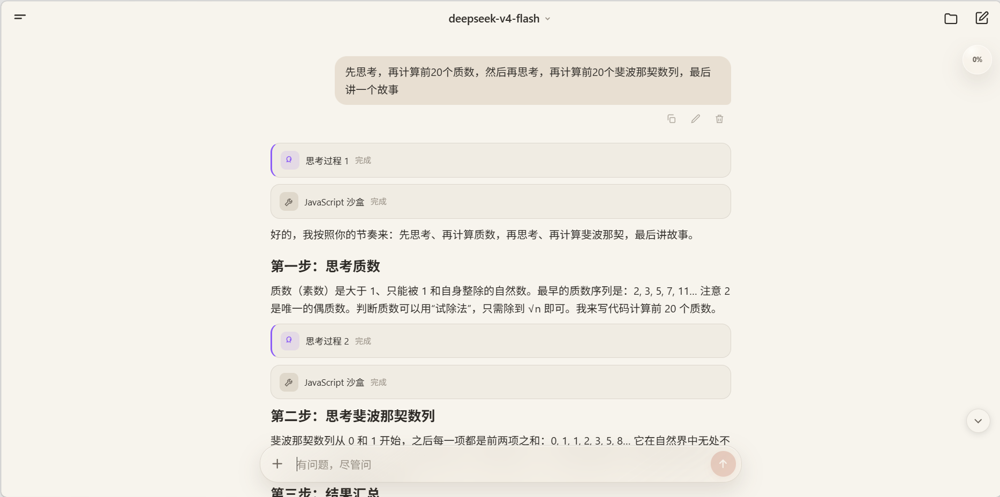
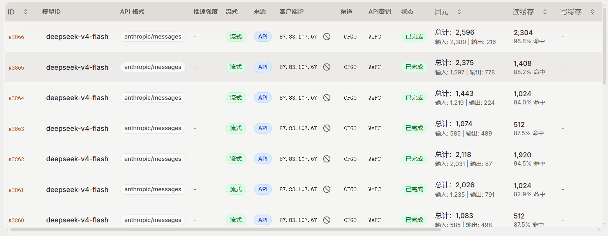
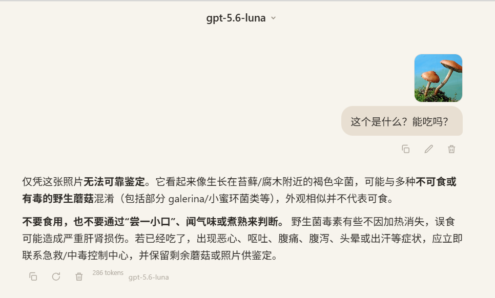

<p align="center">
  
</p>

<h1 align="center">WePChat</h1>

<p align="center">
  简单、轻量、克制——永远这样
</p>


WePChat 是一个本地优先的轻量移动端 AI 聊天应用，当前以静态 Vue/H5 为主体，按 HBuilderX / HTML5+ Android App 方向推进。

项目目标是做一个克制、快速、适合日常使用的 LLM 客户端：对话、Markdown 阅读、文件工作区、轻量代码/网页生成、图片生成与编辑。它不是 ComfyUI、Midjourney 或移动开发环境，也不追求内置完整 Linux。

## 为什么选 WePChat

<div align="center">

**纯前端 · 轻量 · 缓存命中高 · 无预设系统提示词**

</div>

WePChat 是纯静态前端应用，不依赖任何后端服务，任意静态服务器（甚至直接双击 `index.html`）即可运行。它刻意与 `pi-agent` 这类“干重活”的代理工具错位：pi-agent 擅长改代码、跑命令、深度代理长任务，WePChat 专注“走路时掏出手机问点啥”的轻问轻答。

- **纯前端、零部署**：静态 Vue/H5 + IndexedDB 本地存储，数据不出浏览器，无需安装、无需构建、无需后端。
- **轻量克制**：不内置 Linux、不挂 Node.js 运行时、不做沉重配置，打开即聊、用完即走。
- **缓存命中高**：内存 + IndexedDB 双层缓存，会话、长文本、图片持久化不丢，重复查看秒开、不重复请求。
- **无预设系统提示词**：默认不发送任何系统提示词（仅当你在设置里显式填写时才发送），模型只按你当下的提问回答，不被预设人设与规则干扰。
- **手机友好**：轻量移动端设计，走路、通勤、排队时随手掏出手机就能问两句。

### 桌面浏览器访问效果

<div align="center">
  
</div>

### 缓存命中效果

<div align="center">
  
</div>

### 识图效果

<div align="center">
  
</div>

这个项目的初衷是，Cherry Studio / Chatbox 已经过于沉重，不适合我的使用场景了，我得做个简单点。所以 WePChat 适合这些场景：
- 日常问答
- 走路、通勤时掏出手机随手问点啥：轻问轻答、用完即走
- 想法快速验证：WePChat 支持编写 HTML 并预览，以及简单的 JavaScript 代码运行
- 测试模型连通性：WePChat 支持 OpenAI 的 Completions / Responses 接口，支持 Anthropic 的 Messages 接口。配置简单，模型切换方便，可以快速验证连通性
- 日常快速生图：WePChat 支持 OpenAI 的图像生成 / 图像编辑
## 当前能力

- 多会话管理，支持常规对话和生图会话。
- 多模型提供商配置，支持 OpenAI-compatible、Responses、Completions、Messages 等常见接口形态。
- 模型元数据管理，记录上下文、输出上限、视觉、工具、结构化输出、图像生成/编辑等能力。
- Markdown 渲染、代码块复制、链接打开、图片展示。
- 当前会话工作区，支持文件树、新建、上传、编辑、删除、导出和 HTML 运行预览。
- IndexedDB + 内存缓存持久化，避免 Android WebView `localStorage` 配额过小导致大文本和图片丢失。
- Agent 工具调用可视化，工具参数流式生成时提前显示工具卡片。
- 轻量 JavaScript 沙盒，用于计算、文本/JSON/CSV 处理、编码解码和数据转换。
- 工作区文件工具，包括读取片段、写入、精确/正则/忽略空白编辑、目录创建、移动/重命名、批量删除和路径检查。
- HTML 多页面预览，支持工作区内相对链接跳转、地址栏、前进、后退、刷新和外链跳转。
- 图片生成工作台，支持尺寸、质量、格式、背景和风格预设。
- 常规对话中的 `image_go` 工具，可由文本模型判断是否需要转交图片模型。
- 图片生成支持长任务等待、异步任务轮询、大图下载重试与“只取结果、不重新扣费”的恢复入口。
- 数据备份使用 `.wepchat` ZIP 容器导入导出，另支持单文件导出和整工作区 ZIP 导出。
- Android/HBuilderX 环境下支持相册保存、系统分享、公共下载目录写入、从设置打开导出目录（失败时显示并复制路径）和后台运行通知提醒。
- 关于页可检查 GitHub Release，展示更新日志并跳转到 Releases 页面；不会自动下载或安装更新。
- 远程默认配置：可从服务器拉取 JSON 配置作为默认设置，支持 API 地址 / Key / 接口类型与各配置项，获取时自动剥离注释（JSONC）。
## 截图
<div align="center">

<table>
<tr>
<td></td>
<td></td>
<td></td>
</tr>

<tr>
<td></td>
<td></td>
<td></td>
</tr>

</table>

</div>

## 技术路线

WePChat 当前是静态前端项目：

- 入口：`index.html`
- 样式：`css/app.css`
- 主逻辑：`js/app.js`
- 模型 API：`js/api.js`
- 图片 API：`js/image-api.js`
- Agent 工具：`js/tools/`（独立工具模块）与 `js/tools.js`（兼容门面）
- 本地存储：`js/store.js`
- 通用能力：`js/util.js`
- HBuilderX 配置：`manifest.json`
核心运行方式是 H5 + HTML5+。Android App 侧能力依赖 HBuilderX/HTML5+ 的 `plus.*` API，例如文件、相册、分享、压缩、通知和外部浏览器打开。

## Agent 工具边界

WePChat 内置 Agent 工具是受控的轻量工具集，不提供真实 shell、Node.js 包管理器、Python 环境或完整 Linux。

**默认只开启 `run_js` 一个工具**（其余工具在设置 → 工具权限里改为 `ask`/`always` 后启用）：

- `run_js`：隔离 JavaScript 沙盒。需要读取工作区文件时，必须通过 `inputFiles` 显式挂载。
- `list_files` / `read_file` / `write_file` / `edit_file`：工作区文件查看、读取、写入和修改。
- `create_folder` / `move_path` / `path_exists` / `delete_file`：文件夹和路径管理。
- `preview_file`：打开已有 HTML 文件预览。
- `web_fetch`：GET/POST 抓取网页或接口文本，POST 会额外确认。
- `image_go`：生成或编辑图片。

By default WePChat 不发送系统提示词，仅当你在设置里显式填写了「系统提示词」时才会随请求发送。
工具说明和系统提示词快照见 `docs/tools.md`。

## 本地运行

项目是静态页面，直接启动一个静态服务器即可预览。

推荐使用项目自带的 CORS 静态服务器（为跨域请求添加 `Access-Control-Allow-Origin` 等头，避免远程配置拉取被浏览器 / WebView 拦截）：

```bash
python3 server.py 8765
```

> 若只用 `python -m http.server 8765` 预览页面本身也可以，但**拉取远程默认配置会报 CORS 跨域错误**。

然后打开：

```text
http://127.0.0.1:8765/
```

### 远程默认配置

从服务器拉取 JSON 配置作为应用默认设置，带注释的 JSONC 会在获取时自动剥离注释后再解析。

- 配置模板：`wepchat.config.json.template`（含全部配置项与注释说明）。
- 实际使用：复制为 `wepchat.config.json`（去掉 `.template` 后缀，该文件已加入 `.gitignore`）放到服务器，无需去除注释。
- 在应用 设置 → 远程配置 填入配置 URL 并「获取 → 应用」。
- 支持配置 API 地址 / Key / 接口类型（`providers` 数组）及各设置项。
- 启动带 CORS 的服务器后，默认 URL 可填 `http://127.0.0.1:8765/wepchat.config.json`。

## 设计取舍

WePChat 刻意保持轻量：

- 不内置完整 Linux。
- 常规聊天不提供真实 shell。
- 不做长期后台执行承诺。
- 不把图片生成做成重型工作站。
- 不把 HTML 预览做成完整浏览器。
- 不做沉重繁琐的配置、subagent 或智能体体系。

短期重点是让日常对话、文件流转、轻量生成和移动端验证体验足够稳定。

## 开发检查

常用语法检查：

```bash
node --check js/app.js
node --check js/api.js
node --check js/image-api.js
node --check js/tools.js
node --check js/store.js
node --check js/util.js
node --check js/model-metadata.js
git diff --check
```

更多当前状态、风险和下一阶段计划见 `docs/handoff.md`。

## 许可证

WePChat 使用 [MIT License](LICENSE) 开源。

项目包含的第三方组件保留各自的许可证与版权声明；Liquid Glass 适配运行时的声明位于 `libs/liquid-glass-vue.LICENSE.txt`。

## Linux.do
[学ai，上L站](https://linux.do/)
